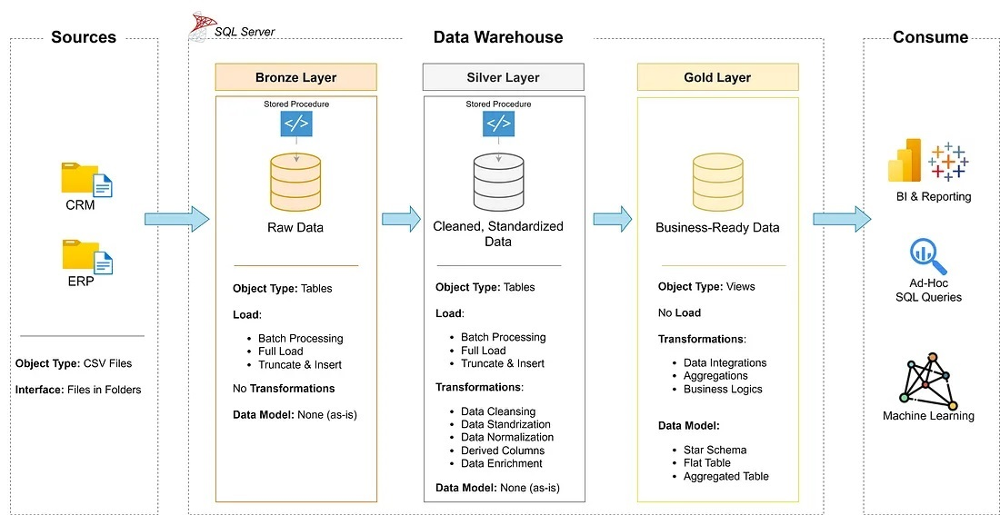
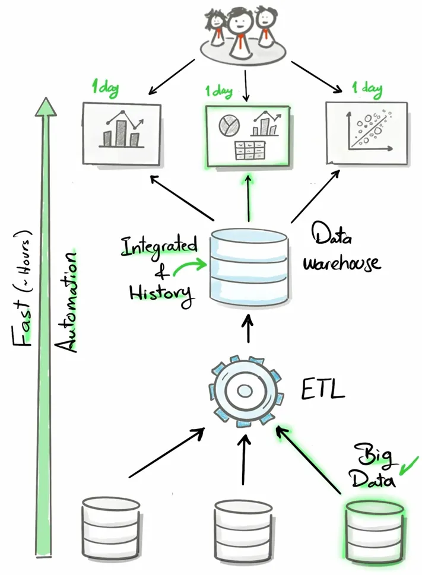
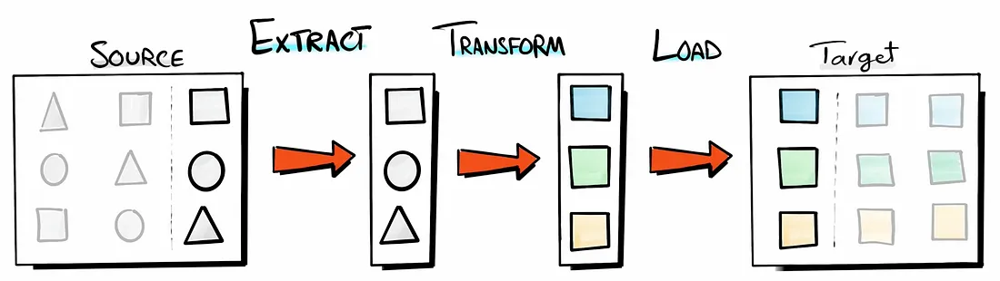
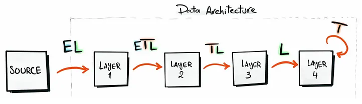
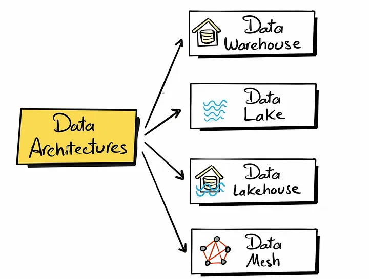
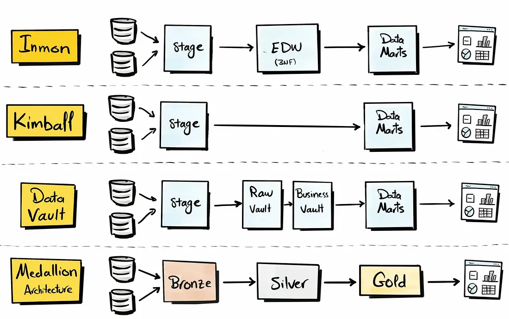
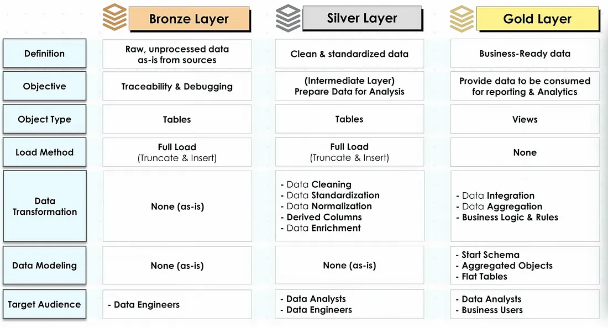
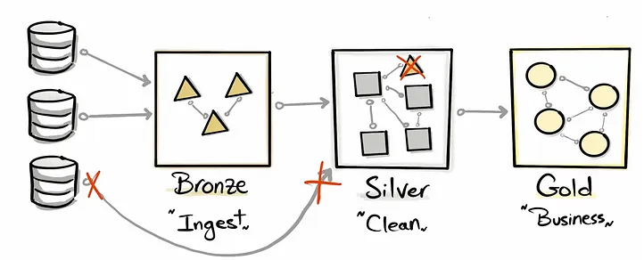

# Construindo um Data Warehouse moderno do zero

!!! info "Objetivo"

    Este projeto demonstra uma solução abrangente de data warehousing e análise, desde a construção de um data warehouse até a geração de insights acionáveis.
    
    Este artigo é inspirado por um canal do YouTube chamado 'Data with Baraa

<!-- more -->

## Introdução

<figure markdown="span">
  { width="500" }
  <figcaption>Fonte: Data with Baraa</figcaption>
</figure>

O que você irá aprender:

- **Arquitetura de Dados**: Projetando um Data Warehouse Moderno Usando a Arquitetura Medallion com camadas - Bronze, Silver e Gold.
- **Pipelines ETL**: Extraindo, transformando e carregando dados de sistemas fontes para o warehouse.
- **Modelagem de Dados**: Desenvolvendo tabelas de fatos e dimensões otimizadas para consultas analíticas.
- **Análise & Relatórios**: Criando relatórios e dashboards baseados em SQL para gerar insights acionáveis.

## O que é um Data Warehouse
> Um data warehouse é um sistema de gerenciamento de dados. Ele é uma coleção de dados orientada a um tema, integrada e não volátil.

<figure markdown="span">
  { width="500" }
  <figcaption>Fonte: Data with Baraa</figcaption>
</figure>

## O que é um ETL
- **Extrair**: extrair os dados como estão da fonte e, no caso de carga incremental, extrair um subconjunto dos dados da fonte.
- **Transformar**: realizar manipulação e transformação desses dados, por exemplo, limpeza de dados, integração, formatação, normalização, etc.
- **Carregar**: armazenar os dados preparados e movê-los para o destino final."

<figure markdown="span">
  { width="500" }
  <figcaption>Fonte: Data with Baraa</figcaption>
</figure>

Às vezes, você não precisa usar um ETL completo nas diferentes etapas do projeto, isso é explicado na figura abaixo:

<figure markdown="span">
  { width="500" }
  <figcaption>Fonte: Data with Baraa</figcaption>
</figure>

## Técnicas de ETL
O gráfico a seguir mostra em detalhes as diferentes técnicas de ETL:

<figure markdown="span">
  { width="500" }
  <figcaption>Fonte: Data with Baraa</figcaption>
</figure>

## As principais etapas deste projeto são:
- Análise de requisitos
- Projeto de uma arquitetura de dados
- Construção das camadas bronze (Bronze), prata (Silver) e ouro (Gold)

### **Etapa 1: Configuração do Projeto**
Baixe as seguintes ferramentas:

* **SQL Server Express**: Servidor leve para hospedar seu banco de dados SQL.
* **SQL Server Management Studio (SSMS)**: GUI para gerenciar e interagir com bancos de dados.
* **Configurar uma conta e repositório no GitHub** para gerenciar, versionar e colaborar no seu código de forma eficiente.
* **DrawIO**: Para desenhar a arquitetura de dados, modelos, fluxos e diagramas.
  Todos os recursos do projeto e o código-fonte podem ser encontrados no GitHub.

### **Etapa 2: Construindo o Data Warehouse**
**Objetivo**
> Desenvolver um data warehouse moderno usando SQL Server para consolidar dados de vendas, possibilitando relatórios analíticos.

* **Fontes de Dados**: Importe dados de dois sistemas fonte (ERP e CRM) fornecidos como arquivos CSV.
* **Qualidade dos Dados**: Limpe e resolva problemas de qualidade dos dados antes da análise.
* **Integração**: Combine ambas as fontes em um modelo de dados amigável para consultas analíticas.
* **Escopo**: Foco apenas no conjunto de dados mais recente; a historização dos dados não é necessária.
* **Documentação**: Forneça documentação clara do modelo de dados para apoiar tanto os stakeholders de negócios quanto as equipes de análise.

### **Arquitetura de Dados**
Existem 4 tipos de arquitetura de dados, que são os seguintes:

1. **Data Warehouse**: Adequado para dados estruturados.
2. **Data Lake**: Mais flexível que o data warehouse, adequado para dados semi-estruturados e não estruturados (dados para Machine Learning).
3. **Data Lakehouse**: Uma mistura entre o data warehouse e o Data Lake.
4. **Data Mesh**: Sistema de gerenciamento de dados descentralizado (vários departamentos, onde cada um deles constrói produtos de dados e compartilha-os).

<figure markdown="span">
  { width="500" }
  <figcaption>Fonte: Data with Baraa</figcaption>
</figure>

Neste projeto, estamos focando na construção de um data warehouse.

Existem quatro abordagens diferentes para construir um data warehouse:

<figure markdown="span">
  { width="500" }
  <figcaption>Fonte: Data with Baraa</figcaption>
</figure>

In this project, we will be using the Medallion architecture.

Designing the layers of the data warehouse

<figure markdown="span">
  { width="500" }
  <figcaption>Fonte: Data with Baraa</figcaption>
</figure>

Separação de Preocupações
Ao projetar uma arquitetura, é importante dividir os componentes complexos em partes menores e independentes.

<figure markdown="span">
  { width="500" }
  <figcaption>Fonte: Data with Baraa</figcaption>
</figure>

High-level Architecture
To draft this architecture, I used Drow.io
<figure markdown="span">
  { width="500" }
  <figcaption>Fonte: Data with Baraa</figcaption>
</figure>
